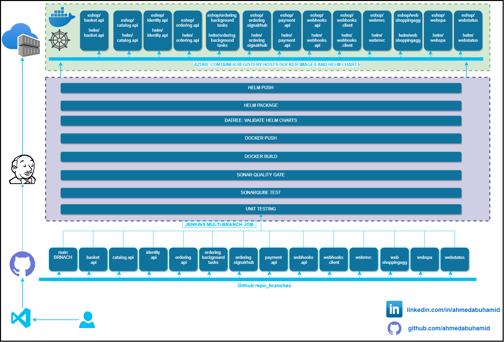
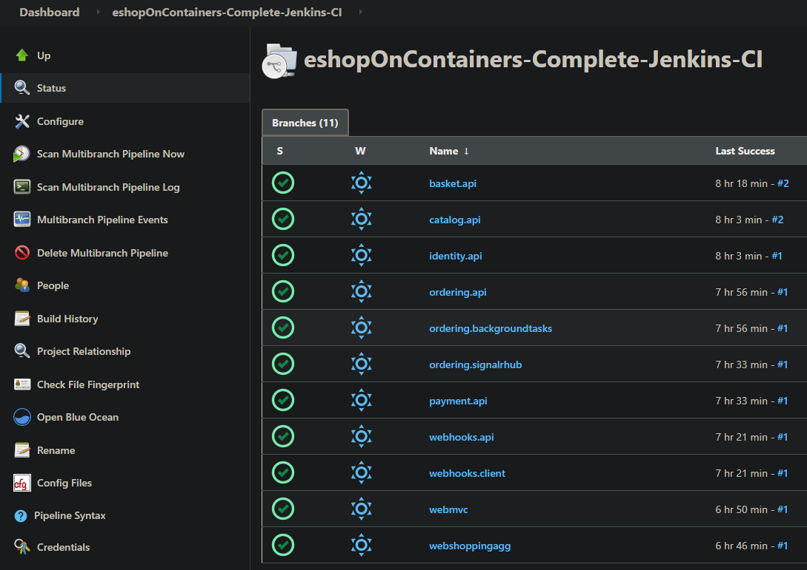
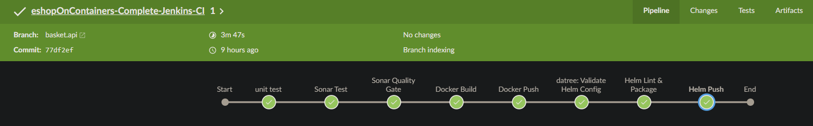
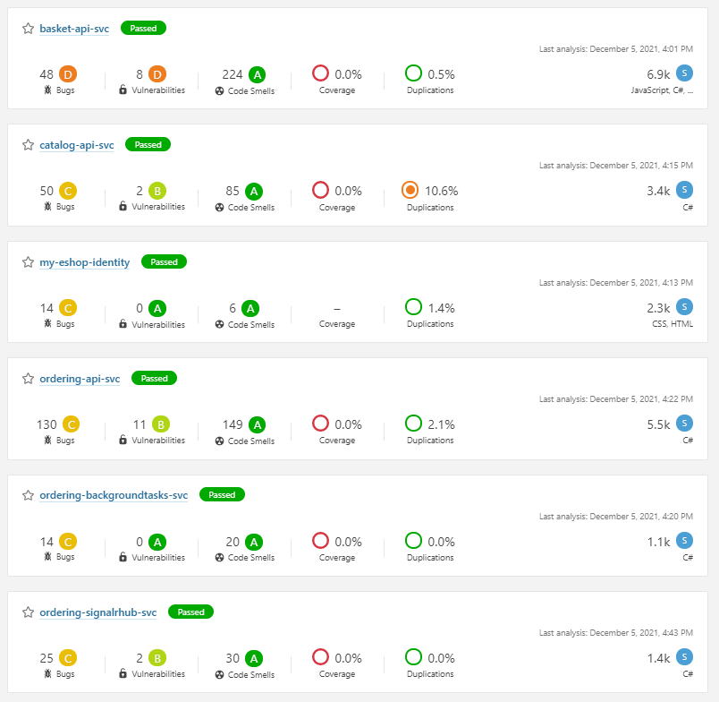
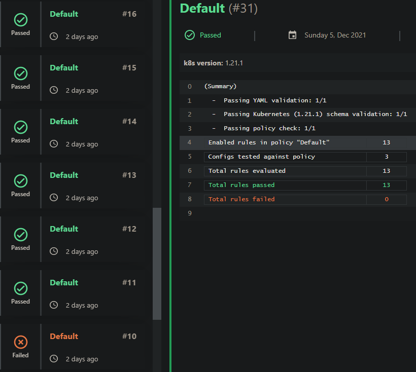
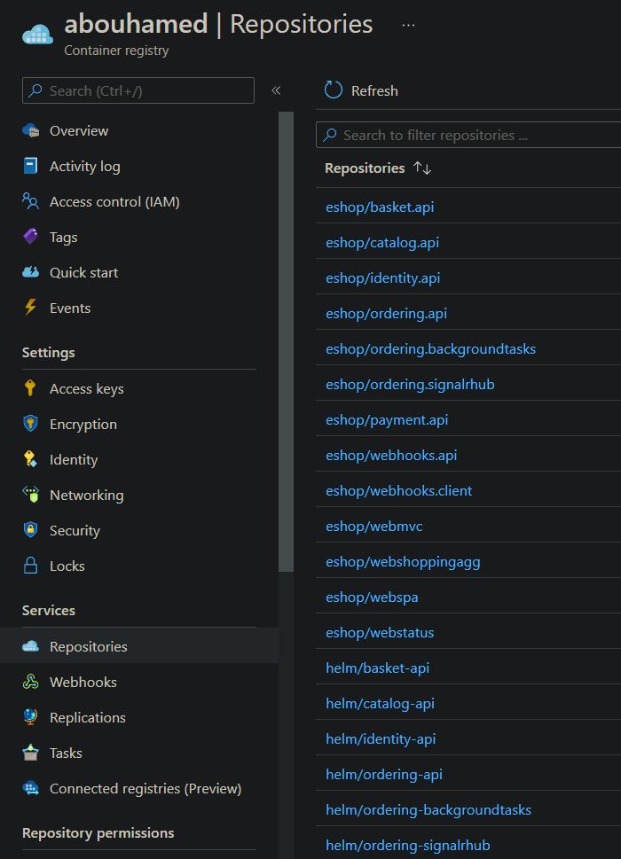
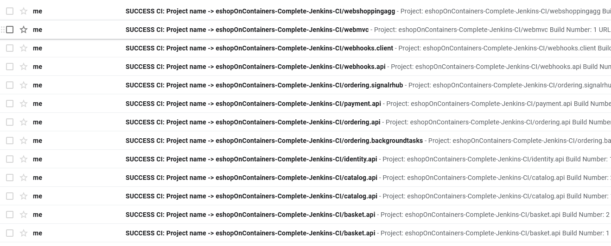

# eshopOnContainers-Complete-Jenkins-CI

[](https://opensource.org/licenses/Apache-2.0)

This project is a complete jenkins continious integration pipeline for thirteen microservice of the  [eShopOnContainers](https://github.com/dotnet-architecture/eShopOnContainers).
eShopOnContainers is a well documented and structured .NET project. 
the purpose of this repo is to devide the code into separate microservices which is tested, built and deployed separately using Jenkins.

ideally you will have one repo/microservice and each repo will have devlop, pre-prod and prod branches.
to be able to demonstrate the concept we will use this single repo and will configure one microservice/branch.

pre-requisites:
---
* Jenkins server
* SonarQube server
* azure container registry
* AKS

I used my repo [provision-azure-infra-terraform-jenkins](https://github.com/ahmedabuhamid/provision-azure-infra-terraform-jenkins) to quickly provision and the needed infra.

How to use:
---
clone the repo and checkout to each branch to see how each microservice was built. each branch will trigger a Jenkins job that will produce two artifacts:

1- docker image of the microservice.

2- packaged Helm chart (to be used in a release pipeline to deploy this particular microservice).

you can use the below command to manually deploy/test the chart in your AKS cluster:
```
helm install $RELEASE_NAME oci://$ACR_NAME.azurecr.io/$CHART_NAME --version $CHART_VERSION
```

The plan for this repository:
---
1- to add release pipeline to deploy to Kubernetes Cluster.

2- to use Jenkins shared library to reduce the repeated code between the microservices.


# work-flow and screenshots:
workflow:


Jenkins Jobs:




SonarQube analysis:


Datree analysis:


Azure Container registery:


Post job mail notification:
